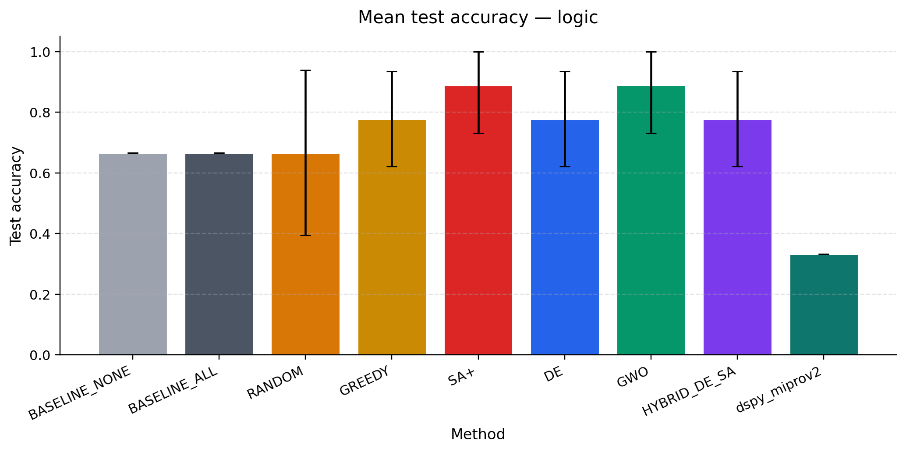
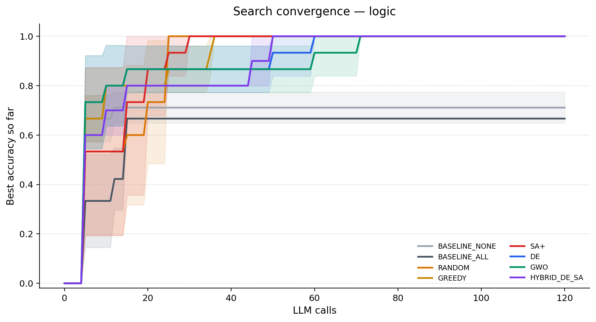
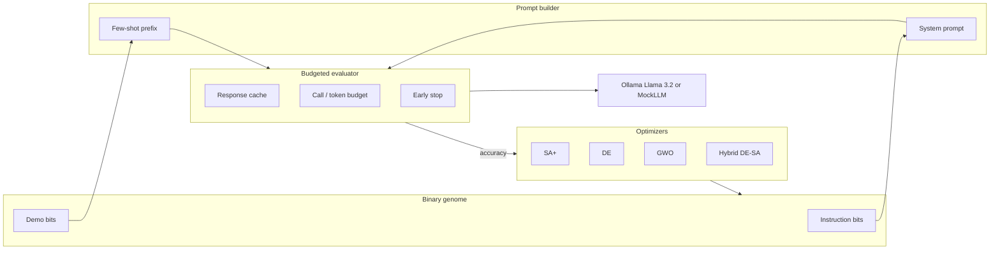

# Joint Prompt Optimization with Metaheuristics

Search over **instruction blocks** and **few-shot demonstrations** as one binary genome. Simulated Annealing, Differential Evolution, Grey Wolf Optimizer, and a DE→SA hybrid compete under a shared LLM-call budget — against greedy, random, and static baselines, plus DSPy MIPROv2.

The pipeline is fully runnable **without a GPU**: a prompt-sensitive mock LLM makes the search landscape real enough for tests, demos, and the dashboard.

[](https://www.python.org/)
[](LICENSE)
[](https://github.com/Samrwitt/prompt_engineering/actions/workflows/ci.yml)

---

## Why this project exists

Most automated prompt engineering tools optimize *either* the instruction *or* the few-shot set. This framework treats them as a **joint combinatorial problem**:

```
x = [ instruction bits | demonstration bits ]  ∈ {0,1}^{B+E}
```

Evaluating `x` requires LLM calls, so every method is capped by the same budget, with caching, early stopping, and a reserved slice of calls for final train/test scoring.

## Results (BBH Boolean Expressions)

Mean test accuracy over 3 seeds, Llama 3.2 via Ollama, shared call budget. Values are from `results/final_scores.json` — not inflated.

| Method | Mean test acc | Std | Mean LLM calls |
| :--- | ---: | ---: | ---: |
| BASELINE_ALL | 66.7% | 0.0 | 15 |
| BASELINE_NONE | 66.7% | 0.0 | 15 |
| RANDOM | 66.7% | 27.2 | 95 |
| GREEDY | 77.8% | 15.7 | 89 |
| DE | 77.8% | 15.7 | 95 |
| HYBRID_DE_SA | 77.8% | 15.7 | 95 |
| **SA+** | **88.9%** | 15.7 | 76 |
| **GWO** | **88.9%** | 15.7 | 95 |
| DSPy MIPROv2 | 33.3% | — | uninstrumented |

On this logic task, adding *every* instruction is no better than adding none. Search has to pick the right subset (operator precedence + output format) and complementary demos. SA+ and GWO do that most consistently here.

Seed count is small (`n=3`), so Wilcoxon tests are underpowered — the dashboard and `python -m src stats` report that honestly instead of projecting extra samples.





## Architecture



**Two backends**

| Backend | Use when |
| :--- | :--- |
| `mock` | Tests, CI, dashboard playground, README demos. Deterministic; correctness depends on prompt quality. |
| `ollama` | Real experiments with `llama3.2` at temperature 0. |

## Quick start

```bash
python -m venv venv
source venv/bin/activate
pip install -r requirements.txt
```

**Offline (no model download):**

```bash
python -m src experiment --fast --backend mock
python -m src plots
python -m src inspect
pytest
```

**Interactive dashboard:**

```bash
streamlit run app.py
```

The dashboard has four views: project overview, logged results, discovered prompts, and a live mock-LLM optimizer playground.

**Local Llama 3.2 (Ollama):**

```bash
ollama pull llama3.2
python -m src experiment --balanced --backend ollama
python -m src stats
```

Presets: `--fast` (debug), `--balanced` (recommended), `--research` (paper-scale). YAML equivalents live in `configs/`.

```bash
python -m src experiment --config configs/balanced.yaml --backend mock
```

## CLI

```bash
python -m src experiment --fast --backend mock
python -m src stats          # Wilcoxon vs BASELINE_ALL
python -m src plots          # figures → docs/figures/
python -m src inspect        # best prompts from runs.jsonl
python -m src dashboard      # Streamlit
python -m src.demo           # 60-second mock walkthrough
```

Or `make test`, `make plots`, `make dashboard`, `make experiment-mock`.

## Repository layout

```
configs/          YAML presets (fast / balanced / research)
data/             BBH Boolean Expressions, arithmetic, GSM8K sample
prompts/          Instruction-block libraries (yes/no and numeric)
src/
  experiment.py   Budgeted runner
  sa.py de.py gwo.py de_sa.py   Metaheuristics
  model.py        Ollama client + MockLLM
  prompt.py       Extraction, genome decode, I/O
  plots.py stats.py visualize.py
app.py            Streamlit dashboard
tests/            Prompt parsing, optimizers, mock LLM, smoke run
results/          Logged runs and scores from real experiments
docs/figures/     Generated plots
```

## Methods

| Method | Role in the comparison |
| :--- | :--- |
| BASELINE_ALL / NONE | Static prompts: every block, or none |
| RANDOM, GREEDY, HILL_CLIMB | Simple search controls |
| SA+ | Adaptive neighborhood, tabu cache, reheating, stagnation stop |
| DE | Current-to-best mutation, annealed sigmoid binarization |
| GWO | Elitist binary Grey Wolf with sharpening sigmoid |
| HYBRID_DE_SA | DE for global search, SA for local refinement |
| DSPy MIPROv2 | External compiler baseline (Ollama only) |

## Design constraints

- Temperature 0 for reproducible generations
- Hard cap on LLM calls; search budget reserves calls for final scoring
- Cache key = `(instruction bits, demo indices, question)`
- Early stop when remaining items cannot beat the current best
- At most `K=5` demonstrations to stay inside context

## Paper

`main.tex` is an LNCS draft of the same study. Code results should be treated as source of truth when they disagree with narrative tables that used projected sample sizes.

## License

MIT. See [LICENSE](LICENSE).
