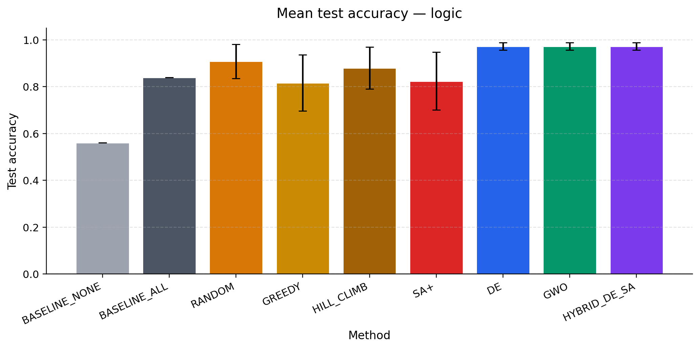
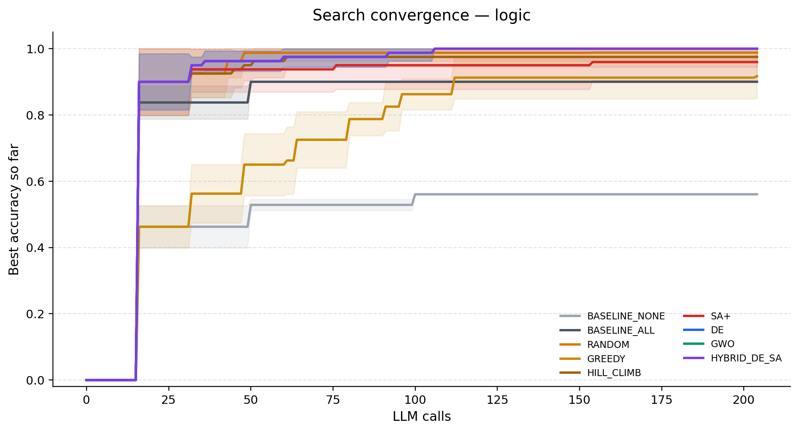
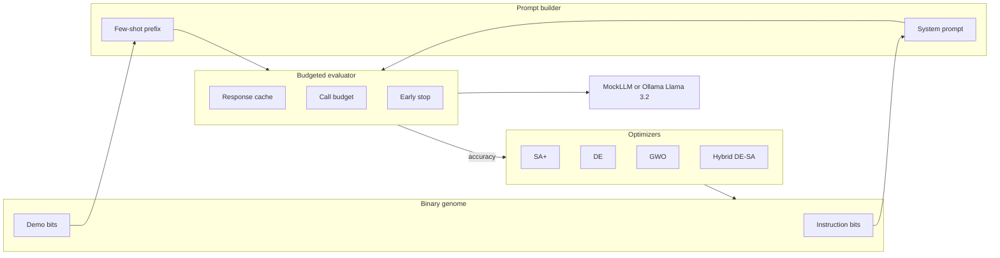

# Joint Prompt Optimization with Metaheuristics

Search over **instruction blocks** and **few-shot demonstrations** as one binary genome. Simulated Annealing, Differential Evolution, Grey Wolf Optimizer, and a DE→SA hybrid compete under a shared call budget against greedy, random, and static baselines.

**Live demo:** [samrwitt.github.io/prompt_engineering](https://samrwitt.github.io/prompt_engineering/) (enable GitHub Pages on `docs/` after the first push).

[](https://www.python.org/)
[](LICENSE)
[](https://github.com/Samrwitt/prompt_engineering/actions/workflows/ci.yml)

---

## Headline result (reproducible, n_test = 50, 5 seeds)

The mock LLM is prompt-sensitive: empty instructions score like chance; good instruction + demo subsets score much higher. That makes the combinatorial search a real optimization problem you can rerun without a GPU.

| Method | Boolean test | Arithmetic test | Wilcoxon vs ALL (logic) |
| :--- | ---: | ---: | :--- |
| BASELINE_NONE | 56.0% | 28.0% | — |
| BASELINE_ALL | 84.0% | 68.0% | reference |
| GREEDY | 81.6% ± 12.0 | 49.6% ± 4.5 | not better |
| SA+ | 82.4% ± 12.3 | 74.8% ± 6.6 | not better |
| RANDOM | 90.8% ± 7.3 | 80.0% ± 3.8 | p = 0.063 |
| HILL_CLIMB | 88.0% ± 8.9 | 77.6% ± 10.5 | not better |
| **DE / GWO / Hybrid** | **97.2% ± 1.6** | **82.8% ± 5.3** | **p = 0.031** |

Protocol: 100 items/task, 50/50 split, demo pool of 16 training examples, max 5 shots, 220-call budget. DE, GWO, and Hybrid converged to the same high-quality region on this landscape.





```bash
pip install -r requirements.txt
python -m src experiment --portfolio   # ~10s, no GPU
python -m src site                     # rebuild docs/index.html
```

Open `docs/index.html` locally if Pages is not enabled yet.

## Why this is not “just another prompt repo”

Most automated prompt tools optimize either the instruction or the few-shot set. This one treats them as a **joint binary program**:

```
x = [ instruction bits | demonstration bits ]  ∈ {0,1}^{B+E}
```

Evaluating `x` costs LLM calls, so every method is capped by the same budget, with caching, early stopping, and reserved calls for the holdout.



## Llama 3.2 pilot (small-n, real model)

Local Ollama run on a 3-item logic holdout, 3 seeds. Accuracy jumps in thirds, so this is a **pilot**, not a significance claim. SA+ and GWO reached 88.9% vs 66.7% for both static baselines. Full table: `results/pilot_ollama/final_scores.json`.


```bash
ollama pull llama3.2
pip install -r requirements-llm.txt
python -m src experiment --balanced --backend ollama
```

## CLI

```bash
python -m src experiment --fast          # debug
python -m src experiment --portfolio     # 5-seed mock benchmark
python -m src stats --path results/benchmark_mock/runs.jsonl
python -m src plots
python -m src inspect
python -m src site
python -m src dashboard                  # needs requirements-dashboard.txt
```

## Layout

```
configs/           fast / portfolio / balanced / research YAML
data/              100 boolean + 100 arithmetic items (verified labels)
prompts/           instruction-block libraries
src/               optimizers, mock+Ollama clients, budgeted eval, site builder
tests/             21 tests (parsing, solvers, optimizers, smoke)
results/benchmark_mock/   headline numbers
results/pilot_ollama/     original Llama 3.2 pilot
docs/              GitHub Pages demo
```

Core install is `numpy/scipy/pandas/matplotlib` — no PyTorch. DSPy and Streamlit are optional extras.

## Methods

| Method | Role |
| :--- | :--- |
| BASELINE_ALL / NONE | Static prompts: every block, or none |
| RANDOM, GREEDY, HILL_CLIMB | Simple search controls |
| SA+ | Adaptive neighborhood, tabu cache, reheating |
| DE | Current-to-best mutation, annealed sigmoid decoding |
| GWO | Elitist binary Grey Wolf |
| HYBRID_DE_SA | DE global search, then SA local refinement |
| DSPy MIPROv2 | Optional Ollama-only compiler baseline |

## License

MIT. See [LICENSE](LICENSE).
